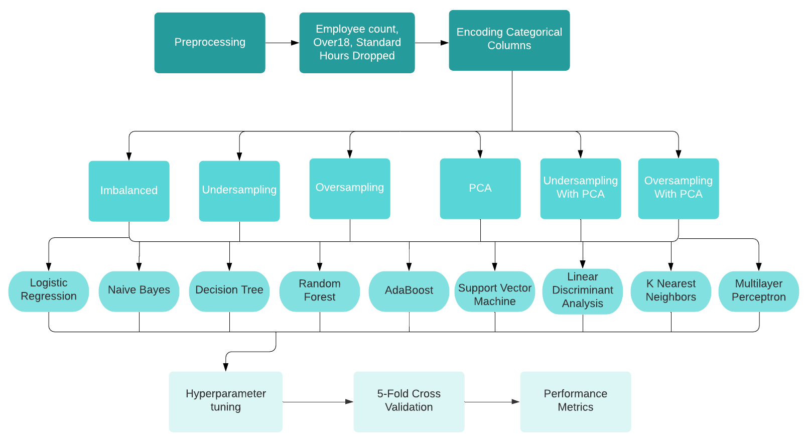
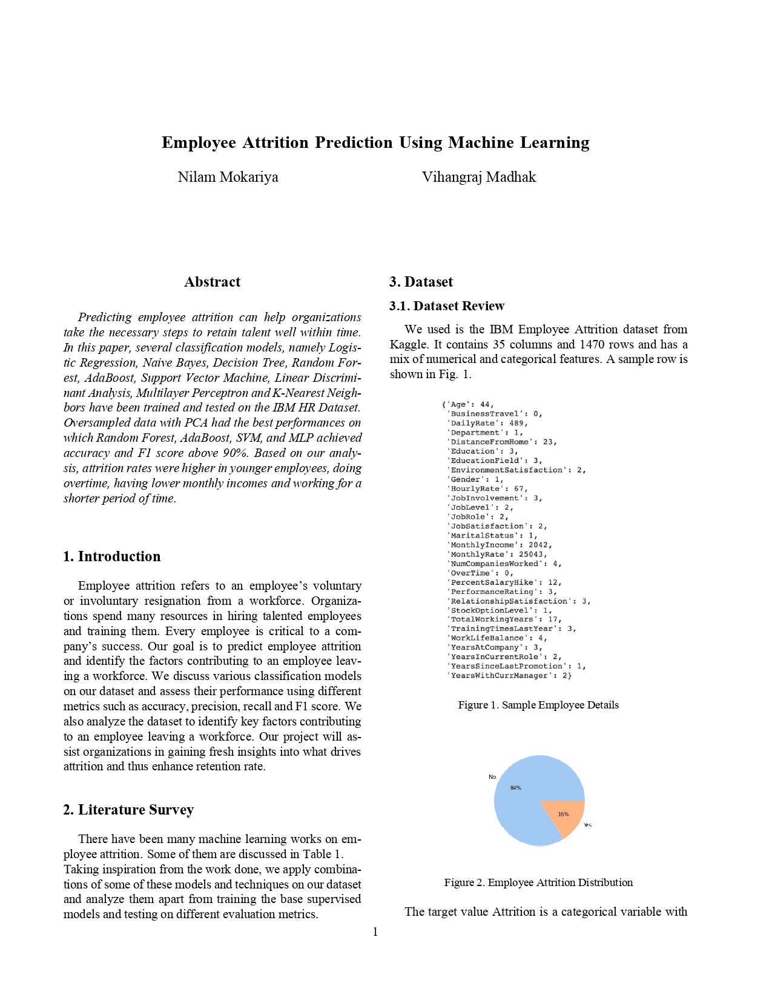
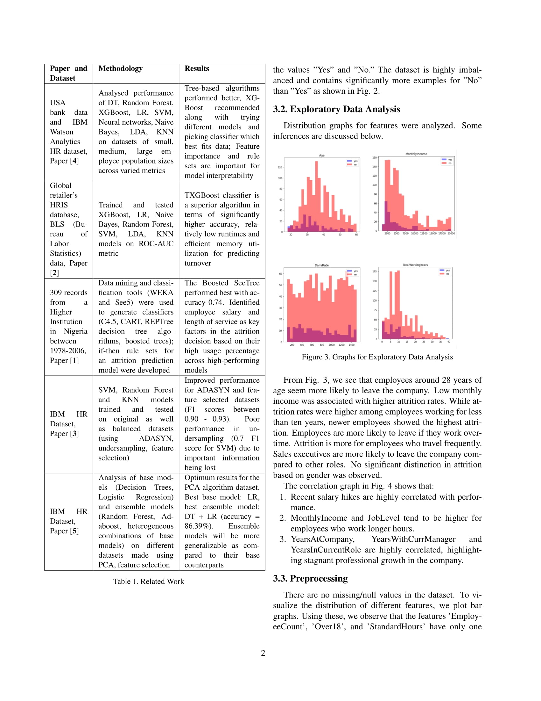
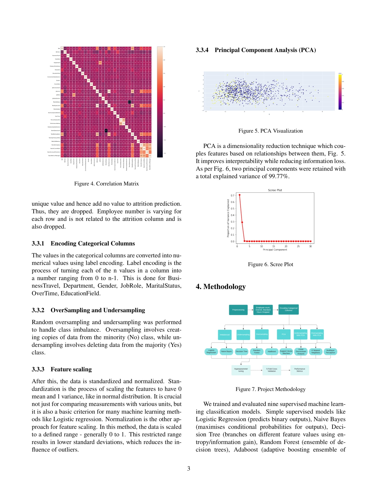
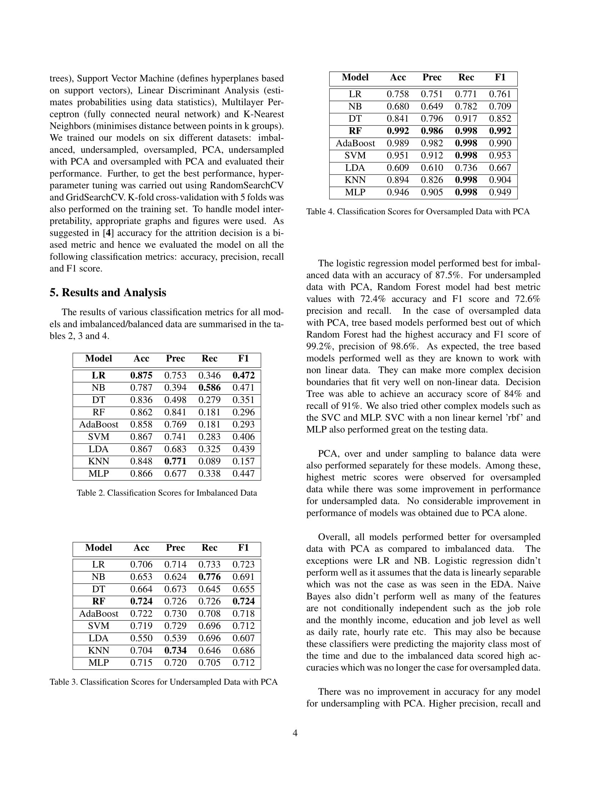
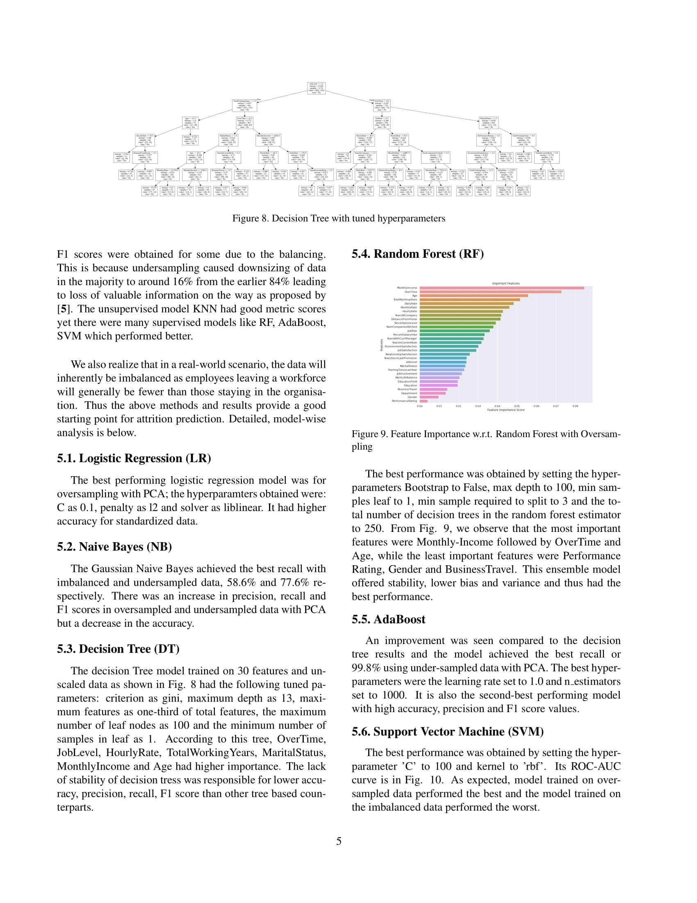
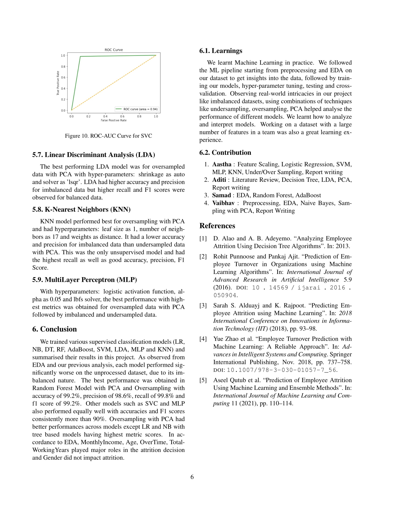

# Employee Attrition Prediction Using Machine Learning

This project was created as a part of CSE343, Machine Learning Course at IIIT Delhi. 

### Group Members
1. [Vihangraj Madhak](https://github.com/madhakvihangraj "GitHub Profile")
2. [Nilam Mokariya](https://github.com/nilammokariya "GitHub Profile")

## Introduction

Employee attrition refers to an employee’s voluntary
or involuntary resignation from a workforce. Organizations spend many resources in hiring talented employees
and training them. Every employee is critical to a company’s success. Our goal was to predict employee attrition
and identify the factors contributing to an employee leaving a workforce. We trained various classification models on our dataset and assessed their performance using different metrics such as accuracy, precision, recall and F1 Score. We
also analyzed the dataset to identify key factors contributing
to an employee leaving a workforce. Our project will assist organizations in gaining fresh insights into what drives
attrition and thus enhance retention rate.

## Methodology

#### Machine Learning Models

We trained and evaluated 9 supervised machine learning classification models.

1. Logistic Regression
2. Naive Bayes
3. Decision Tree
4. Random Forest
5. AdaBoost
6. Support Vector Machine
7. Linear Discriminant Analysis
8. Multilayer Perceptron
9. K-Nearest Neighbors

#### Datasets
We trained our models on 6 different datasets
1. Imabalanced
2. Undersampled
3. Oversampled
4. PCA
5. Undersampling With PCA
6. Oversampling With PCA

Further, to get the best performance, hyperparameter tuning was carried out using RandomSearchCV and GridSearchCV. K-fold cross-validation with 5 folds was also
performed on the training set. To handle model interpretability, appropriate graphs and figures were used.Accuracy for the attrition decision is a biased metric, and hence we evaluated the model on all the
following classification metrics: accuracy, precision, recall
and F1 Score.

## Dataset
We used the [IBM Employee Attrition dataset from Kaggle](https://www.kaggle.com/pavansubhasht/ibm-hr-analytics-attrition-dataset). It contains 35 columns and 1470 rows and has a mix of
numerical and categorical features. A sample row is shown below.

## Results

The figure below shows feature importance w.r.t random forest with oversampling. We observe that the most important
features were MonthlyIncome followed by OverTime and Age, while the least important features were Performance
Rating, Gender and BusinessTravel.

#### Best Performing Model
The best performance was obtained in Random Forest Model
with PCA and Oversampling with an accuracy of 99.2%,
the precision of 98.6%, recall of 99.8% and F1 Score of
99.2%.

## Instructions to run
Jupyter Notebook can be run using Google Colab or locally using Anaconda Navigator.

**Steps to run using Google Colab**
1. Upload the dataset.
2. Click on Runtime -> Run all / Restart and Run all.

## Libraries Used
1. [Numpy](https://numpy.org/)
2. [Pandas](https://pandas.pydata.org/)
3. [Matplotlib](https://matplotlib.org/)
4. [Seaborn](https://seaborn.pydata.org/)
5. [Scikit-learn](https://scikit-learn.org/stable/index.html)

## Report 

# Employee_Attrition_Prediction
